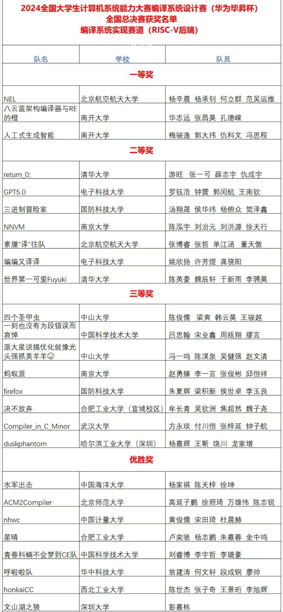

# SysYCompiler2024

本项目基本结构改编自: [sysy](https://gitee.com/xsu1989/sysy.git)

Contest Official repository: [CSC-Compiler](https://gitlab.eduxiji.net/csc1/nscscc)

开发人员 (按拼音):侯华玮 简泽鑫 汤翔晟 杨俯众

## 项目基本结构和介绍

项目目前的文件结构：

- `antlr/`
- `config/`
- `doc/`
- `include/`
- `scripts/`
- `src`
- `submit`
- `sysylib`
- `README.md`