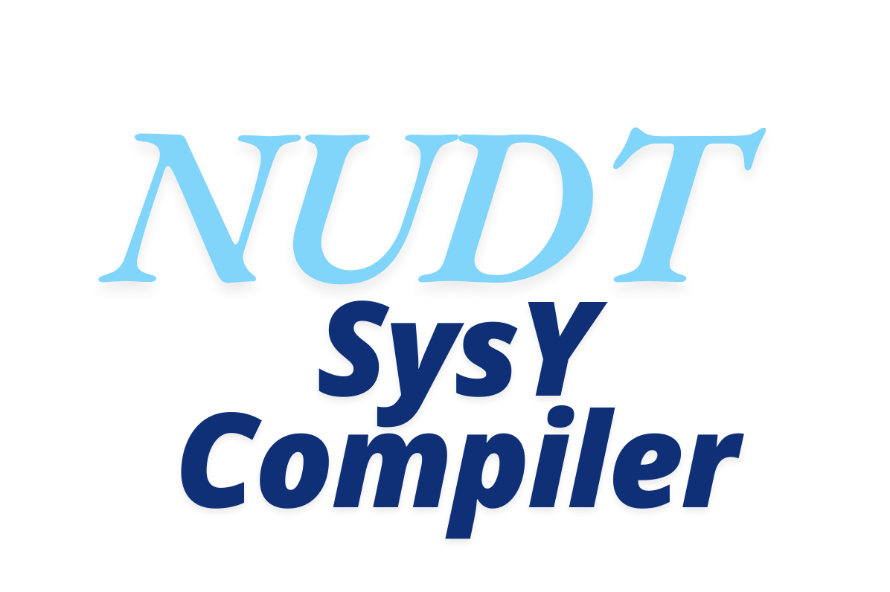
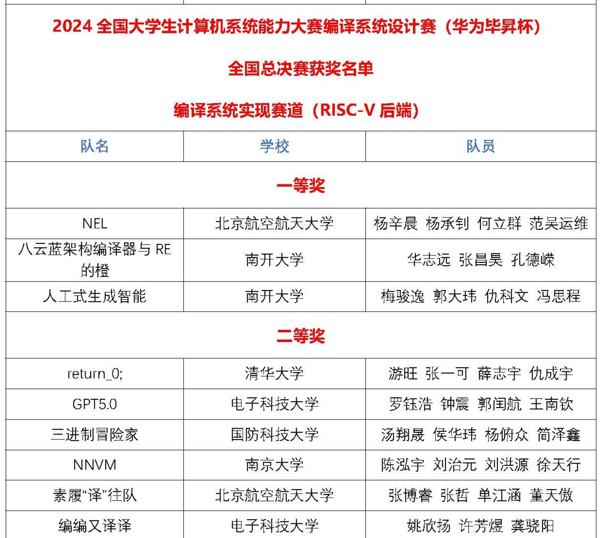

# NUDT SysY Compiler for CSC-2024

<p align="center"> 

</p>

<!-- "https://raw.githubusercontent.com/houhuawei23/nudt-sysyc-csc2024/main/NUDT-SysY-Compiler.png" -->

Reconstructioned from [SysYCompiler](https://gitee.com/triple-adventurer/sys-ycompiler).

## 基本情况

Contributors 开发者:

- [侯华玮](https://github.com/houhuawei23), [汤翔晟](https://github.com/TernaryExplorer), [杨俯众](https://gitee.com/westme10n), [简泽鑫](https://github.com/xinchen-jzx)

<a href="https://github.com/houhuawei23/nudt-sysy-compiler-csc2024-origin/graphs/contributors">
  
</a>

Made with [contributors-img](https://github.com/lacolaco/contributors-img)

---

- 主要开发周期：2024.02 - 2024.08
- 总代码行数 5W+：
  - 手写代码 3W+，根据自定义模板规则自动生成代码 2W+；
- 使用 [ANTLR4](https://github.com/antlr/antlr4) 生成 C++ 前端（Lexer、Parser），生成 AST
- 参照模仿 [LLVM MLIR](https://mlir.llvm.org/)、[CMMC](https://github.com/dtcxzyw/cmmc) 设计实现了两级中间表示（IR 和 MIR），通过全部功能测试样例：
  - 词法分析、语法分析、语义分析、目标代码生成等；
- 实现若干重要的编译优化技术：
  - 死代码删除、循环剥离、循环并行化等；
- 2024 年全国大学生计算机系统能力大赛-编译系统设计赛-全国总决赛二等奖

<p align="center"> 

- 优化效果概览：

决赛性能得分（vs Best Performance）：

<p align="center"> 

比赛结束后修复“依赖关系分析”等 bug 后，加上循环并行化优化后性能（vs GCC-O3）：

<p align="center"> 

在”通用矩阵乘“三重循环上的”循环并行化“优化后效果（vs GCC-O3）：

<p align="center"> 

- 编译器设计框架：

<p align="center"> 

[Commits Histogram](https://github.com/houhuawei23/nudt-sysy-compiler-csc2024-origin/graphs/commit-activity):

<p align="center"> 

[Contributors](https://github.com/houhuawei23/nudt-sysy-compiler-csc2024-origin/graphs/contributors):

<p align="center"> 

## 项目结构

- `src`：源码目录
- `include`：头文件目录
- `third_party`：第三方库目录（需要手动下载）
  - `antlr4`：
    - `antlr4-cpp-runtime-4.12.0-source`：ANTLR4 C++运行时库源代码
    - `antlr-4.12.0-complete.jar`：ANTLR4 Java jar 包
- `doc`：文档目录
- `test`：测试目录，包含测试用例（需要手动下载）

## 运行

- 推荐使用 Debian-12 bookworm 或 Ubuntu 22.04
- 可使用 wsl2，推荐使用裸机 linux 或双系统

### 安装依赖

#### 下载并安装 ANTLR4

- [ANTLR4 Releases](https://github.com/antlr/antlr4/releases)
- [ANTLR4 Downloads](https://github.com/antlr/website-antlr4/tree/gh-pages/download)

这里使用了 ANTLR4 4.12.0 版本，与比赛测试环境中版本一致。

- 下载 antlr4 jar package [antlr-4.12.0-complete.jar](https://github.com/antlr/website-antlr4/blob/gh-pages/download/antlr-4.12.0-complete.jar)
- 下载 ANTLR4 C++运行时库源代码 [antlr4-cpp-runtime-4.12.0-source.zip](https://github.com/antlr/website-antlr4/blob/gh-pages/download/antlr4-cpp-runtime-4.12.0-source.zip)
- 加压到 `third_party/antlr4/` 目录下

在 `third_party/antlr4/antlr4-cpp-runtime-4.12.0-source/` 目录下，执行：

```bash
# pwd: path_to/third-party/antlr4/antlr4-cpp-runtime-4.12.0-source/
mkdir build
cmake -S . -B build -DANTLR_JAR_LOCATION=$(realpath ../antlr-4.12.0-complete.jar) -DWITH_DEMO=True
cmake --build build -j$(nproc)
cmake --install build # install to /usr/local/
```

#### 安装其他依赖

##### must

```bash
sudo apt-get update
sudo apt-get install -y build-essential uuid-dev libutfcpp-dev pkg-config make git cmake openjdk-11-jre
```

##### optional

```bash
# llvm clang
llvm-15-dev

# ninja
ninja-build

# google test
libgtest-dev

# cross-compiler
sudo apt install gcc-riscv64-linux-gnu # or gcc-riscv64-unknown-elf,gcc-11-riscv64-linux-gnu, gcc-arm-linux-gnueabihf

# g++
g++-12-riscv64-linux-gnu
g++-12-arm-linux-gnueabihf

## tldr: Simplified and community-driven man pages
sudo apt-get install -y tldr && tldr -u

```

#### Build the project

```bash
# cd to project root directory

# default use Unix Makefiles
mkdir build
cmake -S . -B build
cmake --build build -j$(nproc)

# use Ninja
cmake -s . -B build -G Ninja
cmake --build build -j$(nproc)

# generate ./compiler executable under project root directory
# ./compiler has two different command line args parse method:
# one for local test, one for official server test
# 1 local test:
Usage: ./compiler [options]
  -f {filename}                     input file
  -i                                Generate IR
  -t {passname} {pasename} ...      opt passes names to run
  -o {filename}                     output file, default gen.ll (-ir) or gen.s (-S)
  -S                                gen assembly
  -O[0-3]                           opt level
  -L[0-2]                           log level: 0=SILENT, 1=INFO, 2=DEBUG

./compiler -f test.sy -i -t mem2reg dce -o test.ll
./compiler -f test.sy -S -t mem2reg -o test.s

# 2 official server test:
./compiler -S -o test.s test.sy
./compiler -S -o test.s test.sy -O1


```

#### Run the test

```bash
# bash test script
./test.sh -t test/2021/functional/ -p mem2reg -p dce -p scp -p sccp -p simplifycfg -L1
./test_asm.sh -t test/2021/functional/ -p mem2reg -p dce -p scp -p sccp -p simplifycfg -L1

# python test script (multi-threading)
python ./submit/runtest.py compiler_path tests_path output_asm_path output_exe_path output_c_path
```
