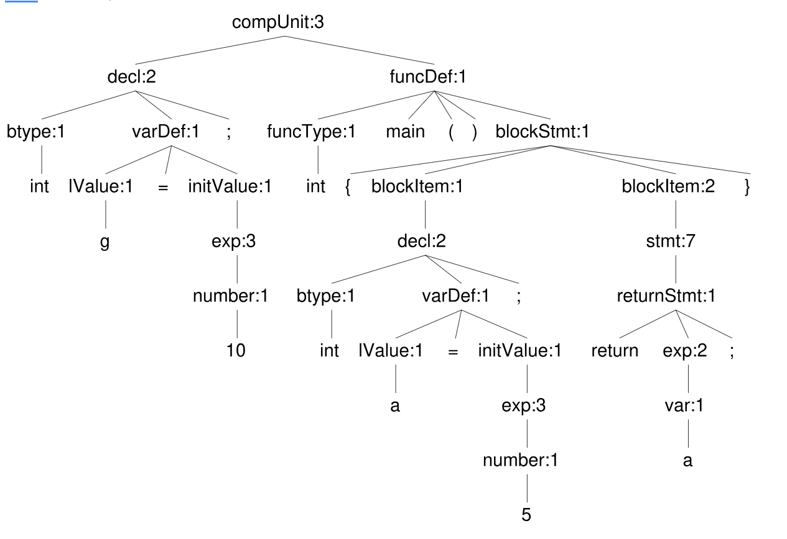
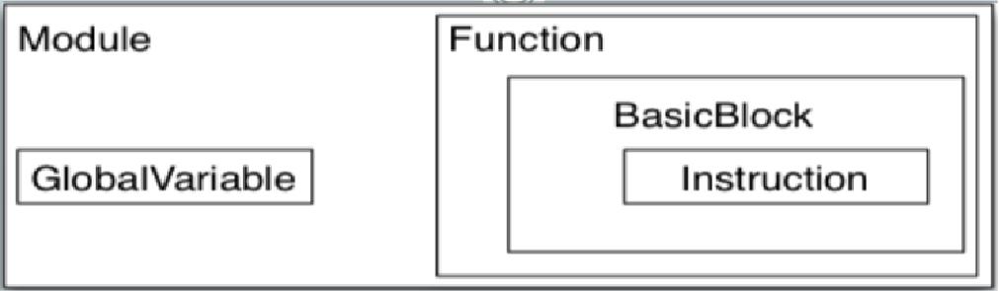
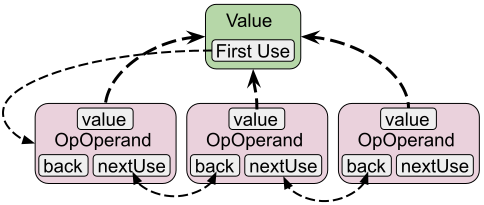

# Introduction

主要内容

1. 了解编译系统设计赛的章程和技术方案
2. 了解什么是“编译”，了解现代编译系统的主要流程、掌握编译器系统的结构和组成部分
3. 了解 24 届编译系统设计赛的时间安排与组员分工，初步规划 25 届编译系统设计赛的时间安排

## 编译 Compile

将一种语言（源语言）编写的程序，翻译成等价的、用另一种语言（目标语言）编写的程序

即：源语言 -- 编译器 -> 目标语言

### 关键问题：

1. 掌握源语言和目标语言
   1. 源语言一般指高级语言，如 C、Java、Python 等；目标语言一般指汇编语言、机器语言等
   2. 在比赛中，我们只需要实现高级语言->汇编，汇编->可执行目标文件使用 gnu 工具链 ld
   3. 如何理解源语言？要掌握源语言的“规则”，即词法、语法和语义
   4. 生成什么样的目标语言？掌握目标语言的“规则”
2. 如何实现“等价”的翻译？如何确保翻译的正确性？
   1. 翻译的规则以及规则的正确性证明
   2. 模式匹配
3. 源语言与目标语言相差太大怎么办？引入“中间语言” IR MLIR 元语言
4. 如何实现“好”的翻译？生成的目标代码的运行速度、体积大小等
   1. 优化：利用源程序中的信息，对程序的中间表示、目标代码进行优化
   2. 好的中间表示：尽可能简单又不过分简单，尽可能保留源语言的语义信息
      1. 关键：设计好的中间表示
5. 如何构建编译器？
   1. 软件工程实践：设计、实现、测试、调试、维护

### 编译的基本流程

我们的编译器将 SysY 源代码编译成 RISC-V 或 ARMv7 汇编，主要由前端-中端-后端三段式结构组成：

- 前端：
  - 通过词法分析和语法分析将源代码解析成抽象语法树；
  - 通过语义分析，扫描抽象语法树，检查是否存在语义错误）；
  - 我们通过定义语法、语义规则，使用前端生成工具自动（ANTLR4）生成语法分析器和语义分析器。
- 中端：
  - 将抽象语法树转换成中间表示（IR）；
  - 在中间表示上进行机器无关优化。
- 后端：
  - 将中间表示转换为目标平台汇编代码，主要包括指令选择、寄存器分配、代码生成等；
  - 实现一些针对特定平台的、特定微体系结构的机器相关优化。

#### 词法/语法分析

理论上讲，我们使用计算理论中的”语言-文法理论“来描述词法和语法规则（参见刘万伟老师的”计算理论“）。程序设计语言中，词法规则一般是由正则表达式定义，对应正规语言；语法规则一般是由上下文无关文法定义，对应上下文无关语言。通常使用 [EBNF](https://en.wikipedia.org/wiki/Extended_Backus%E2%80%93Naur_form) Backus–Naur Form, 即扩展的巴科斯范式）来描述语言的词法和语法规则。

- 词法规则：
  - 词法规则描述了什么样的字符串（chars）是合法的单词（token）
  - 如在 C 语言中，保留字 'const', 'int', 'if'，运算符 '+', '(', ')' ，标识符 'ab', '\_d2', '\_\_123' 等都是合法的单词
- 语法规则：
  - 语法规则定义了什么样的单词流（token stream）或句子（sentence）是合法的语法结构
  - 如在 C 语言中，表达式可以是加法表达式、赋值表达式、条件表达式等，语句可以是赋值语句、条件语句等

下面给出部分在 ANTLR4 中使用 EBNF 定义 SysY 语言的词法和语法规则：

```c
// declare a grammar called SysY
grammar SysY;

/*===-------------------------------------------===*/
/* Lexer rules                                     */
/*===-------------------------------------------===*/

// keywords
CONST: 'const';
INT: 'int';
FLOAT: 'float';

// operators
ASSIGN: '=';
ADD: '+';
SUB: '-';

// punctuations
LPAREN: '(';
RPAREN: ')';
LBRACKET: '[';

// identifier
// Fragments are reusable parts of lexer rules which cannot match on their own
// they need to be referenced from a lexer rule.
fragment ALPHA: [a-zA-Z];
fragment ALPHANUM: [a-zA-Z0-9];
fragment NONDIGIT: [a-zA-Z_];
ID: NONDIGIT (ALPHANUM | '_')*;
// ...

/*===-------------------------------------------===*/
/* Syntax rules                                    */
/*===-------------------------------------------===*/

compUnit: (decl | funcDecl | funcDef)+;

decl: CONST? btype varDef (COMMA varDef)* SEMICOLON;

btype: INT | FLOAT;

varDef: lValue (ASSIGN initValue)?;

initValue: exp | LBRACE (initValue (COMMA initValue)*)? RBRACE;

// ...

```

经过词法分析和语法分析，我们得到抽象语法树（Abstract Syntax Tree, AST），它是源代码的语法结构的树状表示。

```c
int g = 10;

int main() {
    int a = 5;
    return a;
}
```

<p align="center"> 

#### IR 设计

- LLVM IR
- 静态单赋值（Static Single Assignment, SSA）
- IR：内存中的数据结构/序列化为文本的指令序列/字节码

在 C 语言中，我们通过语法语义描述程序信息，主要包括：

- function 函数
- 量/有值的量 data
  - variable 变量
  - constant 常量
- 值的类型
  - base data type: int/float
- statement 语句
- expression 表达式
  - assignment

在 IR 中，我们同样要描述这些信息，但是要将源程序中的语义信心更加充分地暴露出来，且在逻辑上要简单便于分析和修改。

我们使用静态单赋值（SSA）形式的中间表示，静态单赋值意味着在静态程序中，每个变量只会被赋值一次，这样做便于分析数据流（数据的定义和使用形成的依赖关系）。

强类型的，这与 C 语言本身的强类型机制相符合。

在 LLVM IR 中，最核心的概念是 Value，它代表着程序中的一个值，可以是常量、变量、函数调用等，可以说是”一切皆 Value“。

Value 最重要的属性是维护了使用和定义关系，即 Value a 使用了哪些值，由被哪些值使用了，由此形成了”使用-定义链“。

基于 Value，派生出 Constant，Instruction，Function，BasicBlock 等类，它们分别代表着常量、指令（变量），函数，基本块等。

IR 中的程序控制流是由 基本块 + 跳转指令（branch/jump） 构成的，基本块是 IR 的最小执行单位，它包含了指令序列，指令序列中的指令按顺序执行，直到遇到跳转指令（branch/jump）时，控制流转移到其他基本块。

<p align="center"> 

<p align="center"> 

#### AST -> IR

实际上，AST 也可以视作是一种中间表示，但是 AST 仅仅表征了源程序的语法结构，难以体现源程序的语义信息。因此，我们需要将 AST 转换成更加抽象的中间表示，即 IR。

该转换的主要流程是遍历 ANTLR4 前端生成的 AST，根据语义规则，发射出（emit）中间代码，同时要维护符号表和类型信息。

在程序实现上，我们采用 builder 的设计模式，builder 集成了构建 IR 结构与指令的主要逻辑和辅助函数。同时， ANTLR4 提供了遍历语法树的 Vistor 模式和接口，我们只需要重写（override）每一个 visitXXX 函数，在 visitXXX 函数中使用 builder 发射所需的指令和结构（XXX 为 ANTLR4 g4 文件中定义的语法单位名称）。

```c++
class SysYIRGenerator : public SysYBaseVisitor {
private:
  ir::Module* mModule = nullptr;
  ir::IRBuilder mBuilder;
  ir::SymbolTable mTables;
  antlr4::ParserRuleContext* mAstRoot;

public:
  SysYIRGenerator(ir::Module* module, antlr4::ParserRuleContext* root)
    : mModule(module), mAstRoot(root) {}

  ir::Module* buildIR() {
    visit(mAstRoot);
    mModule->rename();
    return mModule;
  }

  //! Override all visit methods
  std::any visitCompUnit(SysYParser::CompUnitContext* ctx) override;
  //! function
  std::any visitFuncType(SysYParser::FuncTypeContext* ctx) override;
  std::any visitFuncDef(SysYParser::FuncDefContext* ctx) override;
  ir::Function* getFunctionSignature(SysYParser::FuncDefContext* ctx);
  std::any visitBlockStmt(SysYParser::BlockStmtContext* ctx) override;
  //! visitDecl
  std::any visitDecl(SysYParser::DeclContext* ctx) override;
  // ...
}
```

## 主流编译器/编译系统

GCC，LLVM

- GCC：GNU Compiler Collection，GNU 编译器套件
- LLVM：Low Level Virtual Machine，低级虚拟机

## Next

Work to do:

- 读一下 sysy-2022 语言规范和运行时库定义
- 读并调试 nudt-sysy-2024 代码，理解流程、架构
- 调研 2020-2024 参赛队代码，总结技术点：编程语言、所用工具、设计思想
- 配好环境，舒服的开发、编程、调试环境
